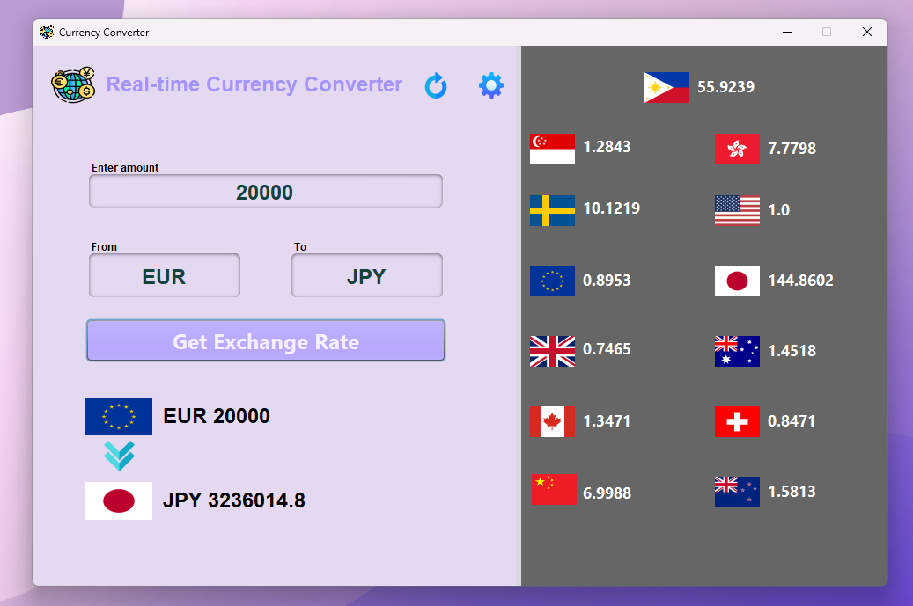

# Real-time Currency Converter

This is a simple real-time currency converter application that allows users to convert between various currencies. The project is built using Java and exported as a NetBeans project.

## Sample Output



## Features

- **Real-time conversion**: Convert between multiple currencies with up-to-date exchange rates.
- **Simple UI**: User-friendly interface for easy use.
- **Multi-currency support**: Supports a wide range of currencies like PHP, USD, EUR, and more.

## Prerequisites

Before running the project, ensure you have the following installed:

- **Java Development Kit (JDK)**: Version 8 or higher.
- **NetBeans IDE**: Or any Java-supported IDE to run the project.

### Clone or Download the Repository
Clone this repository to your local machine using:
```bash
git clone https://github.com/yourusername/simpleCurrencyConverter.git
```
or download the .zip file and import on Apache NetBeans.

### Supports 193 currencies:
```bash
- USD
- AED
- AFN
- ALL
- AMD
- ANG
- AOA
- ARS
- AUD
- AWG
- AZN
- BAM
- BBD
- BDT
- BGN
- BHD
- BIF
- BMD
- BND
- BOB
- BRL
- BSD
- BTN
- BWP
- BYN
- BZD
- CAD
- CDF
- CHF
- CLP
- CNY
- COP
- CRC
- CUP
- CVE
- CZK
- DJF
- DKK
- DOP
- DZD
- EGP
- ERN
- ETB
- EUR
- FJD
- FKP
- FOK
- GBP
- GEL
- GGP
- GHS
- GIP
- GMD
- GNF
- GTQ
- GYD
- HKD
- HNL
- HRK
- HTG
- HUF
- IDR
- ILS
- IMP
- INR
- IQD
- IRR
- ISK
- JEP
- JMD
- JOD
- JPY
- KES
- KGS
- KHR
- KID
- KMF
- KRW
- KWD
- KYD
- KZT
- LAK
- LBP
- LKR
- LRD
- LSL
- LYD
- MAD
- MDL
- MGA
- MKD
- MMK
- MNT
- MOP
- MRU
- MUR
- MVR
- MWK
- MXN
- MYR
- MZN
- NAD
- NGN
- NIO
- NOK
- NPR
- NZD
- OMR
- PAB
- PEN
- PGK
- PHP
- PKR
- PLN
- PYG
- QAR
- RON
- RSD
- RUB
- RWF
- SAR
- SBD
- SCR
- SDG
- SEK
- SGD
- SHP
- SLE
- SLL
- SOS
- SRD
- SSP
- STN
- SYP
- SZL
- THB
- TJS
- TMT
- TND
- TOP
- TRY
- TTD
- TVD
- TWD
- TZS
- UAH
- UGX
- UYU
- UZS
- VES
- VND
- VUV
- WST
- XAF
- XCD
- XDR
- XOF
- XPF
- YER
- ZAR
- ZMW
- ZWL
```
